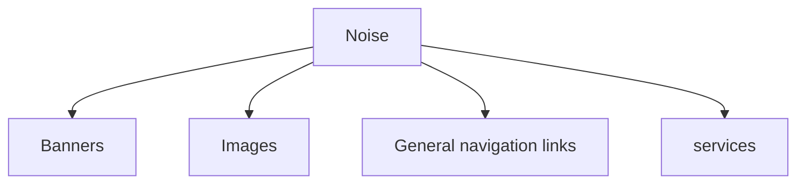

# Chapter 1: Information Retrieval and Search Engines
## 1.1 Information Retrieval

> [[#1.1 Information Retrieval|Information Retrieval]] is a field concerned with the structure, analysis, or-  
ganization, storage, searching, and retrieval of information.

\- Salton, 1968
- Search for information on the Web **almost all the time** 
- Need to improve search by coming up with easier and faster ways to find the right information 
- **Who do it:** computer scientists, sofware engineers, information scientists, search engine optimizers 
$\Rightarrow$ **[[#1.1 Information Retrieval|Information Retrieval]]**
$\Rightarrow$ **Core task:** *understanding and modeling how people compare texts, and designing computer algorithms to accurately perform this comparison!*
## 1.2 Search engines
> The practical application of [[#1.1 Information Retrieval|information retrieval]] techniques to large-scale text collections

- Examples: 
	- Web search engine
	- Desktop search engine 
	- Enterprise search engine
- The big issue of [[#1.1 Information Retrieval|IR]] and [[#1.2 Search engines|SE]] 
## 1.3 Search engineers
- Primarily people trained in computer science, mostly with a systems or database background 
- Few of them have training in [[#1.1 Information Retrieval|information retrieval]]
- The majority of [[#1.2 Search engines|SE]]
## 1.4 Web Search

## 1.5 Other Search Applications
- Desktop search engines:
	- Index and search files stored locally on a computer or local network
	- Require understanding of file formats, metadata, creation times, etc.
	- Used to find documents and files on a single machine or small network
- Enterprise search engines:
	- Index and search documents across an entire organization or business
	- Manage retention (lưu trữ) and compliance of emails, files, and other communications
	- Used to find business information across multiple systems and locations
	- Aid in satisfying regulatory requirements for data retention
	- Provide organization-wide content management and collaboration
## 1.6 Other Information Retrieval Appplications
- Document routing, filtering, and selective dissemination
- Text clustering and categorization
- Summarization systems: reduce documents to a few key paragraphs, sentences, or phrases describing their content
- Information extraction systems: identify named entities, such as places and dates, and combine this information into structured records that describe relationships between these entities
- Topic detection and tracking systems: identify events in streams of news articles and similar information sources, tracking these events as they evolve
- Expert search systems: identify members of organizations who are experts in a specified area 
- Question answering systems: integrate information from multiple sources to provide concise answers to specific questions
- Multimedia information retrieval systems

# Chapter 2: Architecture of a Search Engine
## 2.1 Basic IR System Architecture
![[Review chap 1 to chap 6 2023-10-27 02.16.27.excalidraw]]
- Primary goals of [[#1.2 Search engines|SE]]
	- Effectiveness (quality): retrieve the most relevant set of documents possible for a query
	- Efficiency (speed): process queries from users as quickly as possible 
- Search engine has two major components 
	- Indexing process 
	- Query process 

## 2.2 Building blocks: 
### Text acquisition
- Task: identify and make available the documents that will be searched 
#### Crawler 
- General web crawler 
	- Follow the links on web pages to discover and download new pages 
	- Efficiently find huge numbers of web pages (coverage) and keep them up-to-date (freshness)  
	- Single site crawlers for site search  
	- Topical or focused crawlers for vertical search 
- Document crawlers for enterprise and desktop search 
	- Follow links and scan directories
#### Feeds
- Mechanism for accessing a real-time stream of documents
	- News feed is a constant stream of news stories and updates 
- A search engine acquires new documents from a feed simply by monitoring it
	- RSS is a common standard used for web feeds for content such as news, blogs, or video
#### Conversion
- Convert documents into a consistent text plus metadata format 
	- HTML, XML, PDF, Word, … $\rightarrow$ XML 
- Convert text encoding for different languages 
	- 8-bit ASCII code represents 256 characters, Chinese have many more than 256 characters $\rightarrow$ cannot by represented 8-bit ASCII 
	- Unicode (16-bit words) represent most of the world’s languages
#### Document data store 
- Database used to manage large numbers of documents and the structured data that is associated with them 
- Stores text, metadata and other related content (links or anchor text) for documents 
- Provides very fast access to document contents for search engine components 
- Can use a relational database system to store documents and metadata 
	- Use a simpler, more efficient storage system is used because of huge numbers of documents
### Text transformation
#### Parser 
> Processing the sequence of text tokens in the document to recognize structural elements e.g., titles, links, headings, etc. 
- Tokenizer recognizes “words” in the text 
	- Must consider issues like capitalization, hyphens, apostrophes, non-alpha characters, separators 
- Markup languages such as HTML, XML often used to specify structure 
	- Tags used to specify document elements: E.g. <h/2> Overview <h/2> 
	- Document parser uses syntax of markup language (or other formatting) to identify structure
#### Stopping 
> Remove common words e.g., “and”, “or”, “the”, “in” 
- Some impact on efficiency and effectiveness 
- Can be a problem for some queries 
#### Stemming 
> Group words derived from a common stem e.g., “computer”, “computers”, “computing”, “compute” 
- Usually effective, but not for all queries 
- Benefits vary for different languages
#### Link extraction and analysis 
> Makes use of links and anchor text in web pages 
- Link analysis identifies popularity and community information 
	- e.g., PageRank, Hubs & Authorities 
- Anchor text can significantly enhance the representation of pages pointed to by links 
- Significant impact on web search 
	- Less importance in other applications
#### Information Extraction 
> Identify classes of index terms that are important for some applications e.g., named entity recognizers identify classes such as people, locations, companies, dates, etc. 
#### Classifier
> Identifies class-related metadata for documents 
- i.e., assigns labels to documents (identifying documents as spam, and identifying the non-content parts of documents, such as advertising)
- e.g., topics (“sports”, “politics”, or “business”), reading levels, sentiment, genre 
- Use depends on application
### Index Creation
#### Document Statistics 
> Gathers counts and positions of words and other features 
- Ranking algorithm uses to compute doc scores 
#### Weighting 
> Computes weights for index terms 
- Used in ranking algorithm e.g., TF-IDF weight 
	- Combination of *term frequency* in document and *inverse document frequency* in the collection
#### Inversion 
> Core of indexing process 
- Converts document-term information to term-document for indexing
	- Difficult for very large numbers of documents 
- Format of inverted file is designed for fast query processing 
	- Must also handle updates 
	- Compression used for efficiency
#### Index Distribution 
> Distributes indexes across multiple computers and/or multiple sites on a network 
- Essential for fast query processing with large numbers of documents 
- Many variations 
	- Document distribution, term distribution, replication 
- P2P and distributed [[#1.1 Information Retrieval|IR]] involve search across multiple sites
### User Interaction 
#### Query input 
> Provides interface and parser for query language 
- Most web queries are very simple (few operators), other applications may use forms 
- Query language used to describe more complex queries and results of query transformation 
	- e.g., Boolean queries, Indri and Galago query languages 
	- Similar to SQL language used in database applications 
	- [[#1.1 Information Retrieval|IR]] query languages also allow content and structure specifications, but focus on content
#### Query transformation 
> Improves initial query, both before and after initial search 
- Includes text transformation techniques used for documents (e.g. tokenization, stopping) 
- Spell checking and query suggestion provide alternatives to original query 
- Query expansion and relevance feedback modify the original query with additional terms
#### Results output 
> Constructs the display of ranked documents for a query 
- Generates snippets to show how queries match documents 
- Highlights important words and passages 
- Retrieves appropriate advertising in many applications 
- May provide clustering and other visualization tools
### Ranking 
#### Scoring 
- Calculates scores for documents using a ranking algorithm 
- Core component of search engine 
- Basic form of score is $\sum\limits_{i}q_{i}d_{i}:$ $q_{i}$ and $d_{i}$ are query and document term weights for term $i$
- Many variations of ranking algorithms and retrieval models
#### Performance optimization 
> Designing ranking algorithms for efficient processing 
- Term-at-a time vs. document-at-a-time processing 
- Safe vs. unsafe optimizations 
#### Distribution 
> Processing queries in a distributed environment 
- Query broker distributes queries and assembles results 
- Caching is a form of distributed searching
### Evaluation
#### Logging 
> Logging user queries and interaction is crucial for improving search effectiveness and efficiency 
- Query *logs* and *click-through* data or dwell time used for query suggestion, spell checking, query caching, ranking, advertising search, and other components 
#### Ranking analysis 
> Measuring and tuning ranking effectiveness 
#### Performance analysis 
> Measuring and tuning system efficiency
# Chapter 3: Crawls and Feeds
## 3.1 What to search?
- *Everything* you possibly can!
- Every document answers at least one question
- The best documents answer many more

The number of questions it can answer increases $\rightarrow$ Not easy to find the best documents to show to the user
## 3.2 Crawling the Web
> Build a search engine that searches web pages $\rightarrow$ need the content of web pages $\rightarrow$ copy web pages

- Finding and downloading web pages: *crawling*, the program downloads pages: web *crawler*
- Challenges in copying pages?
	- The sheer scale of the Web: at least tens of billions of pages on the Internet and constantly created
	- Web pages are usually not under the control of the people building the search engine database 
### 3.2.1 Retrieving Web pages
- Each web page has unique uniform resource locator (URL) 
- **The most common HTTP request type is *GET request:*** 
  $\rightarrow$ asks server to send the page called /csinfo/people.html
- **POST** request: similar to **GET** request but sending additional information to the server → click a button to buy something or to edit a web page
- The web crawler *connects to web servers to find pages*. 
- Pages may *link to other pages on the same server or on different servers*
- **Frontier:** request queue that is used to store new URL that the crawler has not seen it before.
- ***Why should a crawler use multiple threads?***
	- Waits for the DNS server response 
	- Waits for the connection to the web server to be acknowledged
	- Waits for the web page data to be sent from the server
- ***Problem:*** *When a web page is fetched, it is parsed and all of the links on that page are added to the request queue*
- ***Politeness policies:***
	- Reasonable web crawlers do not fetch more than one page at a time from a particular web server
	- Web crawlers wait at least a few seconds, and sometimes minutes, between requests to the same web server
- *Request queue is logically split into a single queue per web server*
- A simple crawling thread implementation 
### 3.2.2 Freshness
- ***Why does web crawler need to revisit pages it has already crawled?***
	- Web pages are *constantly being added, deleted, and modified*
	- To *see if they have changed* in order to maintain the freshness of the document collection
- *Check for page changes:* **using HTTP protocol** because it has a special request type called **HEAD**
- ***Metric to be used to optimize crawlers:*** **Age** 
  $$\begin{align}
  \text{Age}(\lambda,t) &= \int_{0}^{t}P(\text{page change at time }x)(t-x)dx \\
  &= \int_{0}^{t}\lambda e^{-\lambda x}(t-x)dx
  \end{align}$$
  $\lambda: \frac{1}{t}$ 
### Focused Crawling
> Focus on a specific topic of information
- Movie -> search engine can lead to more information about movies
- Accuracy(vertical search) > Accuracy(general search): because lack of extraneous information in the  document collection
> **Method 1:** crawl a full copy of the Web and then throw out all unrelated pages
*Disadvantage:* huge amount of disk space and bandwidth
Most of the web pages will be discarded at the end

>**Method 2:** focused crawling -> requires some automatic means for determining whether a page is about a particular topic

### Deep Web 
> Deep Web (hidden Web): difficult to find
- Private sites
- Form results
- Scripted pages
### Sitemaps
- ***Problem:*** site owners cannot adequately tell crawlers about their sites

## 3.3 Crawling documents and emails
- ***Where to store email, word processing documents, presentation or spreadsheets?*** $\rightarrow$ Desktop/Laptop computer
- Is it challenged as crawling desktop data?
	- Update speed
	- Disk space
	- Requirement of a focus on data privacy
## 3.4 Documents feeds
> A document sequence in which published documents afrom a single source can be ordered
- Two kinds of document feeds: push and pull
	- **Push:** alerts the subscribers to new documents
		- RSS: Really Simple Syndication, RDF Site Summary, or Rich Site Summary
	- **Pull:** requires subscribers to check periodically for new documents
## 3.5 Conversion problem: character encodings
- Text on pages is a series of little pictures called *letters* or *glyphs*
- Character encoding is *a mapping* between bits and glyphs
	- ASCII: 1-byte standard
	- CJK (Chinese-Japanese-Korean): 2-byte standard
	  
## 3.6 Storing documents
- *Documents converted to some common format:* need to be stored in preparation for indexing
	- Simplest document storage is no document storage 
- ***Basic requirements***
	- Random access
	- Compression
	- Updating 
	- Benefits of using a database system or a customized storage system
### 3.6.1 Using a Database System
> A database takes care of the difficult details of storing small pieces of data 
- *Most databases also run as a network server*, so that the documents are easily available on the network
- Databases also tend to come with useful import and analysis tools
### 3.6.2 Random Access 
- To *retrieve documents quickly* in order to compute a snippet for a search result: random access
- Data store such that we can request the content of a document based on its URL
- *Easiest way* to handle this kind of lookup is with hashing
### BigTable
- Very largest document collections demand custom document storage systems
- The table is *split into small pieces, called tablets, which are served by thousands of machines*
- *No query language:* no complex queries -> row-level transactions

## 3.7 Delete duplicates
### Duplicate
- The use of multiple URLs to point to the same web page and mirror sites can cause a crawler to generate large numbers of duplicate pages
- Detecting exact duplicates is a relatively simple task that can be done using *checksumming* techniques.
- Based on the content of the document 
***Any document file containing the same text would have the same checksum!*** 
### Nearly duplicate
> Near-duplicate documents: *more difficult to detect*
	Web: same content but differ in the advertisements, dates or formatting
- Use threshold to define a near-duplicate document
	- 90% of the words in the documents are the same
- Two scenarios for near-duplicate detection
	- Search scenario: $O(N)$
- Discovery scenario: $O(N^{2})$
### Fingerprints
The basic process of generating fingerprints:
1. The document is *parsed into words*. *Non-word content*, such as punctuation, HTML tags, and additional whitespace, *is removed* (see section 4.3).
2. The words are *grouped into contiguous n-grams for some n*. These are usually *overlapping sequences of words* (see section 4.3.5), although some techniques use non-overlapping sequences.
3. *Some of the n-grams are selected* to represent the document.
4. The *selected n-grams are hashed to improve retrieval efficiency and further reduce the size* of the representation.
5. The hash values are stored, typically in an *inverted index*
## 3.8 Remove noise 
> Content block takes up less than 20% of the display area of the page

- One way to detect the largest flat area of the distribution is to *represent a web page as a sequence of bits* 
- $b_{n} = 1$ indicates that the $n$th token is a tag, and $b_{n} = 0$ otherwise 
Find values of $i$ and $j$ to maximize both the number of tags below $i$ and above $j$ and the number of non-tag tokens between $i$ and $j$ 
$$\sum\limits_{n=0}^{i-1}b_{n} + \sum\limits_{n=i}^{i}(1-b_{n})+\sum\limits_{n=j+1}^{N-1}b_{n}$$

where $N$ is the number of tokens in the pages.
# Chapter 4: Text Processing
## 4.1 From Words to Terms
> Textual preprocessing phase typically performed by an IR engine, taking as input a document and yielding its *index terms* 
- Generic terms 
	- Conjunctions and prepositions 
	- Low discriminative power
	- High *term frequency*
- Specific terms
	- Higher discriminative power
	- Low *document frequency*

## 4.2 Text statistics
- ***Zipf ’s law:*** the frequency of the $r$th most common word is inversely proportional to $r$ or, alternatively, the *rank* of a word times its frequency ($f$) is approximately a constant ($k$) $$r\cdot f = k$$
The probability of occurrence for the $r$th ranked word is decided by $$r\cdot P_{r} = c$$
where $c$ is a constant (For English, $c \approx 0.1$)
### 4.2.1 Vocabulary Growth
- ***Heap’s Law:*** The above findings relate the frequency and relevance of words in a corpus 
- The vocabulary size $V$ can be computed as $$V = KN^{\beta}$$
where $N$ is the size (in words) of the document collection, $K$ is a constant (10-100) and $0<\beta<1$ typically between 0.4 and 0.6
### 4.2.2 Estimating Collection and Result Set Sizes
- Word occurrence statistics *can also be used to estimate the size of the results from a web search*
## 4.3 Document parsing 
### 4.3.1 Tokenizing 
> Tokenizing is the process of forming words from the sequence of characters in a document

- Issues?
	- Small words (one or two characters) 
	- Both hyphenated and non-hyphenated forms of many words are common 
	- Special characters
	- …
### 4.3.2 Stopping
- *Determiners:* “the,” “a,” “an,” “that,” and “those” 
- *Prepositions:* “over,” “under,” “above,” and “below,” 
- Stopping: Text processing stops when one is seen, and they are thrown out 
	- Removing too many words: decrease retrieval effectiveness
	- Not removing stopwords : cause some problems in ranking
### 4.3.3 Stemming
> A component of text processing that captures the relationships between different variations of a word
- Two basic types of stemmers: *algorithmic* and *dictionary-based* 
	- **Algorithmic stemmer** 
		- cakes → cake, dogs → dog 
		- “century” and “centuries”? : *false negative* 
		- “I” and “is? : *false positive*
	- **Dictionary-based stemmer:** store lists of related words in a large dictionary 
		- The dictionary cannot be infinitely long, so it cannot react automatically to new words
- Combine an algorithmic stemmer with a dictionary-based stemmer: *Krovetz stemmer* 
### 4.3.4 Phrases and N-grams
- ***Noun phrase:*** sequences of nouns, or adjectives followed by nouns 
- Defined by *part-of-speech (POS) tagger:* 
	- NN (singular noun), NNS (plural noun), VB (verb), VBD (verb, past tense), VBN (verb, past participle), IN (preposition), JJ (adjective), CC (conjunction, e.g., “and”, “or”), PRP (pronoun), and MD (modal auxiliary, e.g., “can”, will”)
- ***Much simpler definition of a phrase:*** any sequence of n words, known as an n-gram “to be or not to be” could certainly make use of n-grams 
- ***Use n-gram indexing:*** a fast method of incorporating phrase features in the ranking 
## 4.4 Document structure and markup 
> Fields or attributes of database records are a critical part of searching 
## 4.5 Link analysis
> The words “the somewhere page” will be displayed differently than regular text, usually underlined or in a different color 

### 4.5.1 Anchor text
- Two properties that make it particularly useful for ranking web pages 
	- *Very short*, perhaps two or three words 
	- *Describe a destination page* from a different perspective 
- Simple algorithm for ranking pages: 
	- Search through all links in the collection, looking for anchor text that is an exact match for the user’s query. 
	- Each time there is a match, add 1 to the score of the destination pages 
	- Pages would then be *ranked in decreasing order* of this score
### 4.5.2 PageRank
> Based on the idea of a random surfer
- PageRank for any page $u$ $$PR(u) = \sum\limits_{v\in B_{u}}\frac{PR(v)}{L(v)}$$
  $B_{u}$ is the set of pages that point to $U$, and $L(v)$ is the number of outgoing links from page $v$ 
- Pseudocode for the iterative PageRank algorithm 
### 4.5.3 Link quality
- Post $b$ is influential, because author $A$ has decided to write about it. 
- PageRank perspective, $a$ and $b$ have links to each other, and therefore neither is more influential than the other 
- Comments section of a blog can also be a source of link spam 
- ***Solution:*** The link still appears on the blog, but search engines are designed to ignore all links marked `rel=nofollow`
## 4.6 Information Extraction: Hidden Markov models for extraction
> A language technology that focuses on extracting structure from text
- Text tagged by information extraction: a sentence and the corresponding XML markup after using information extraction
- Two main approaches for recognizing entity:
	- Rule-based approach: uses one or more *lexicons* (lists of words and phrases) that categorize names
	- Statistical approach: use probabilistic model of the words and around an entity $\rightarrow$ *[[#Hidden Markov Model]] (HMM)*
### Hidden Markov Model
- Problem: words can have many different meanings
	- “Marathon”: race or location?
- Need context → *next word in the sequence depends on only a small number of the previous words*
# Chapter 5: Ranking with Indexes
## 5.1 Abstract model of raking
- The components of the abstract model of ranking: documents, features, queries, the retrieval function, and document scores
- Ranking function can be expressed as $$R(Q,D) = \Sigma_{i}g_{i}(Q)f_{i}(D)$$ where $f_{i}$ is feature function extracting a number from the document, while $g_{i}$ is feature function extracting a value from the query 
## 5.2 Inverted Indexes
Example: look for “adaptive filtering” 
$\rightarrow$ Go to “Index” and find the word starts with “a” 
$\rightarrow$ See “adaptive filtering”
$\rightarrow$ See the pages that contain that words
> We think of words being a part of documents $\rightarrow$ *inverted* $\rightarrow$ documents are associated with words
- Each index term has its own inverted list that holds the relevant data for that terms 
	- In an index for a book, the relevant data is a list of page numbers
	- In a search engine, the data might be *a list of documents or a list of word occurrences*
### 5.3.1 Documents 
- Each one of these boxes is a posting
- “fish” appears in all four sentences, because the numbers 1, 2, 3, and 4 appear by it 

### 5.3.2 Counts
> Each word in the index corresponds to a document feature
### 5.3.3 Positions 
> An inverted index, with word positions 
### 5.3.4 Fields and extents
- Example: every email contains sender information and a subject line. All of these are instances of what we will call ***document fields***, which are sections of documents that carry some kind of semantic meaning.
> ***An extent*** is a contiguous region of a document
- If the title of a book started on the fifth word and ended just before the ninth word we could encode that as (5,9)
### 5.3.5 Scores
- ***Whether should system store the value of the feature function?*** 
  > It should store feature function values because it is too computationally intensive to compute during the query processing phase
- Store the final value right in the inverted list
	- “fish” that has postings like \[(1:3.6), (3:2.2)\]: total feature value for “fish” in document 1 is 3.6, and in document 3 it is 2.2
- ***How about the system’s flexibility?***
  > Both increase and decrease
### 5.3.6 Ordering
- ***Why does a system need an ordering score?***
  > The query processing engine can focus only on the top part of each inverted list
## 5.3 Compression
- **Memory hierarchy?** 
  > Memory Hierarchy is an enhancement to organize the memory such that it can minimize the access time
- The inverted lists for a large collection are themselves very large 
	- Compression allows the same inverted list data to be stored in less space 
	-  [?] Any disadvantage of compression?
- Processor can process $p$ inverted list postings per second, a memory system that can supply the processor with $m$ postings each second 
	- The number of postings processed each second is then $\min (m,p)$
	- What happens if $p>m$ or $p<m$?
- Introduce compression ratio $r$ (processor read $mr$ postings each second), decompress factor $d$ (processor process dp postings each second)
	- Process $\min(mr, dp)$ postings each second
### 5.3.1 Entropy and  Ambiguity
Consider the sequence: 0, 1, 0, 3, 0, 2, 0
Encoded by binary digits: 00 01 00 10 00 11 00
Encoding 0 using just a single 0 bit: 0 01 0 10 0 11 0
- Use *prefix codes* and *prefix-fee codes* to avoid ambiguity
- *Entropy* measures the predictability of the input 
$\rightarrow$ The result: 0 101 0 111 0 110 0 (13 bits) 
### 5.3.2 Delta Encoding
- Consider the sequence: 1, 5, 9, 18, 23, 24, 30, 44, 45, 48
- The encoding sequence: 1, 4, 4, 9, 5, 1, 6, 14, 1, 3 
### 5.3.3 Bit-Aligned Codes
- Uses a single symbol to encode numbers 
### 5.3.4 Byte-Aligned Codes
- Sample encodings for v-byte (variable byte length) 
### 5.3.5 In practice
- New compression schemes are developed every year.
- [?] Why are these new schemes necessary?
> Compression algorithm is tightly coupled with the state of modern CPUs and memory systems
- Now: are lower compression ratios attractive? 
(doc, pos): (1,1)(1,7)(2,6)(2,17)(2,197)(3,1)
- Group to (doc,count,[pos]): ((1,2,[1,7])(2,3,[6,17,197])(3,1,[1])
- Data encoding: (1,2,[1,6])(1,3,[6,11,180])(1,1,[1])
- Deal with sequence first: 1,2,1,6,1,3,6,11,180,1,1,1
- V-byte based compression: 81 82 81 86 81 83 86 
### 5.3.6 Skipping and Skip Pointers
Consider the Boolean query `galago AND animal`. 
Let $d_{g}$ and $d_{a}$ be the first document number in the inverted list for “galago.” and “animal.” respectively
While there are still documents in the lists for “galago” and “animal,” loop: 
If $d_{g}<d_{a}$, set $d_{g}$ to the next document number in the “galago” list 
If  $d_{a}<d_{g}$ , set $d_{a}$ to the next document number in the “animal” list.
If $d_{g}=d_{a}$, the document $d_{a}$ contains both “galago” and “animal”. Move both $d_{g}$ and $d_{a}$ to the next documents in the inverted lists for “galago” and “animal,” respectively
Skip ahead $k$ documents to a new document $s_{a}$. Repeat until  $s_{a}b\geq d_{g}$ narrow down to  documents

## 5.4 Axuiliary structures
- Vocabulary and statistics
- Documents, snippets, and external systems 
## 5.5 Index construction
### 5.5.1 Simple construction

### 5.5.2 Merging

### 5.5.3 Parallelism and distribution
- Use many inexpensive servers together and use distributed processing software to coordinate the activities of search engine 
	- The amount of data to index in the largest systems is exploding 
	- Simple economics 
- RPC, CORBA, Java RMI, and SOAP have been developed to allow function calls across machine boundaries 
- Data placement: decides whether data processing is efficient 
- The `MapReduce` library automatically launches many Mapper and Reducer tasks on a cluster of machines
	- Mapper and Reducer tasks 
### 5.5.4 Update
- Most interesting document collections are constantly changing 
	- Collections tend to get bigger over time 
	- The contents of documents can change over time
- Two techniques to solve the problem of update
	- Index merging 
	- Result merging 
## 5.6 Query processing
### 5.6.1 Document-at-a-time evaluation
- The simplest way, at least conceptually, to perform retrieval with an inverted file.
- Document-at-a-time query evaluation. The numbers $(x:y)$ represent a document number $(x)$and a word count $(y)$

### 5.6.2 Term-at-a-time evaluation

### 5.6.3 Optimization techniques
- List skipping 
	- Skip pointers in an inverted list. The gray boxes show skip pointers, which point into the white boxes, which are inverted list postings 
- Conjunctive processing 
	- Conjunctive processing works best when one of the query terms is rare
	- Conjunctive processing can be employed with both term-at-a-time and document-at-a-time systems
### 5.6.4 Structured queries
> Evaluation tree for the structured query 

### 5.6.5 Distributed evaluation
- Document distribution
	- Each index server acts as a search engine for a small fraction of the total document collection
- Term distribution
	- A single index is built for the whole cluster of machines. Each inverted list in that index is then assigned to one index server.
### 5.6.6 aching
- Broadly speaking, caching means storing something you might want to use later 
- Broadly speaking, caching means storing something you might want to use later 
- Processing a query against a large corpus can be very computationally intensive $\rightarrow$ keep it around. 
# Chapter 6: Queries and Interfaces
## 6.1 Information needs and queries
- The number of relevant documents being sought 
- The tasks that led to the requirement for information
- Queries can represent very different information needs and may require different search techniques and ranking algorithms to produce the best rankings.
- A query can be a poor representation of the information need. 
## 6.2 Query Transformation and refinement
### 6.2.1 Stopping and stemming revisited 
- Stopword removal can be done at query time instead of during document indexing. Stopwords can be treated as:
	- Normal words
	- Removed, or removed except under certain conditions
- *Query-based* stemming is another technique for increasing the flexibility of the search engine
	- Bad case: The query “fish village” will produce very different results from the query “fishing village”, but many stemming algorithms would reduce “fishing” to “fish” → using the appropriate word variants, instead of word to a word stem
- ***Term association measure:*** *Dice’s coefficient* 
  $n_{a}$ is the number of windows (or documents) containing word $a$, $n_{b}$ is the number of windows containing word $b$,$n_{ab}$ is the number of windows containing both words $a$ and $b$, and $N$ is the number of text windows in the collection, then *Dice’s coefficient* is $$2 \cdot \frac{n_{ab}}{n_{a}+n_{b}}$$

### 6.2.2 Spell checking and suggestions
> Spell checking is an extremely important part of query processing?
- Basic approach used in many spelling checkers: *spelling dictionary*
	- “Word” Not found? $\rightarrow$ similarity measure: edit distance
	- extenssions $\rightarrow$ extensions (insertion error): edit distance 2
	- poiner $\rightarrow$ pointer (deletion error)
	- marshmellow $\rightarrow$ marshmallow (substitution error)
	- brimingham $\rightarrow$ birmingham (transposition error) 
- ***Noisy channel model:*** a person chooses a word $w$, probability distribution $P(w)$. noisy channel causes the person to write the word $e$ instead with probability $P(e|w)$. Probabilities $P(w)$, called the *language model*. rank the corrections  $\rightarrow P(e|w)P(w)$
	- Context? $$\lambda P(w)+(1-\lambda)P(w|w_{p})$$where $P(w|w_{p})$ the probability of a word $W$ following the previous word $w_{p}$, $\lambda$ is a parameter that specifies the relative importance of the two probabilities
### 6.2.3 Query expansion
- ***Term association measures*** 
### 6.2.4 Relevance feedback
### 6.2.5 Context and personalization
- The results of a query will be the same regardless of 
	- Who submitted the query, 
	- Why the query was submitted, 
	- Where the query was submitted, 
	- What other queries were submitted in the same session
- **Context:** affects the relevance of retrieved documents and could potentially have a signifcant impact on the ranking algorithm
	- Difficult to capture and represent
$\rightarrow$ learning *user models* $\rightarrow$ personalized: problems?
- The most useful contextual information for improving search quality is based on past interactions with the search engine
- Local search based on geographic context can also produce substantial improvements, including 3 main steps:
	1. Identify the geographic region associated with web pages, using location metadata that has been manually added to the document, or by automatically identifying locations, such as place names, city names, or country names, in the document text.
	2. Identify the geographic region associated with the query using automatic techniques. 
	3. Rank web pages using a comparison of the query and document location information in addition to the usual text- and link-based features 

## 6.3 Showing the results
### 6.3.1 Result page and Snippets
- Successful interactions with a search engine depend on the user understanding the results. 
	- Visualization techniques 
	- *Document summaries:* title, URL, links to live, cached versions of the page, a short text summary (snippet)
$\rightarrow$ **Need: text summarization techniques!** 
- ***Luhn’s algorithm*** 
### 6.3.2 Advertising and Search
- Advertising is a key component of web search engines?
	- That is how companies generate revenue
- Goal?
	- Find advertisements that are appropriate for the query context
- Advertisers bid for keywords that describe topics associated with their product
- The key issues:
	- Techniques for matching short pieces of text (the query and the advertisement) 
	- Selecting keywords to represent the content of web pages
### 6.3.3 Clustering the results
- Clustering groups documents? 
	- Similar in content and labels → quickly scanned for relevance.
- Clusters formed by a search engine from top-ranked documents for the query “tropical fish”. Numbers in brackets are the number of documents in the cluster.
## 6.4 Cross-language ssearch
- Translating queries for one or more monolingual search engines covering different languages
- Use a large bilingual dictionary 
	- Statistical machine translation models
