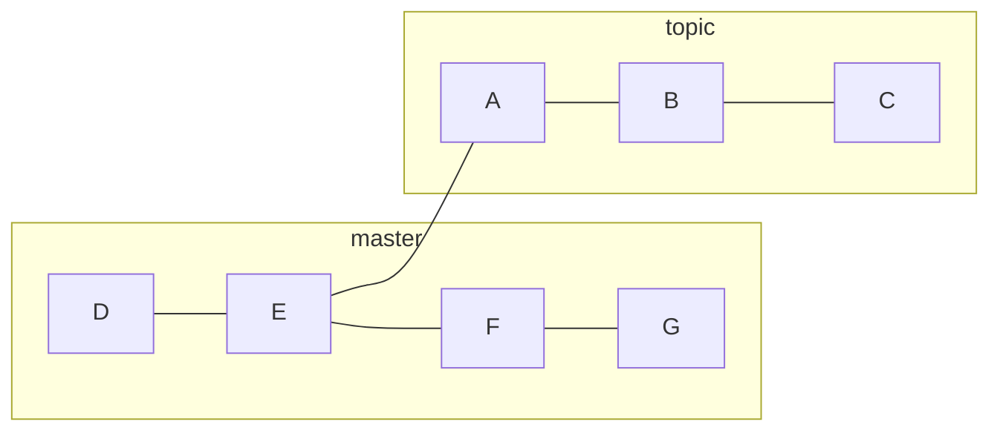
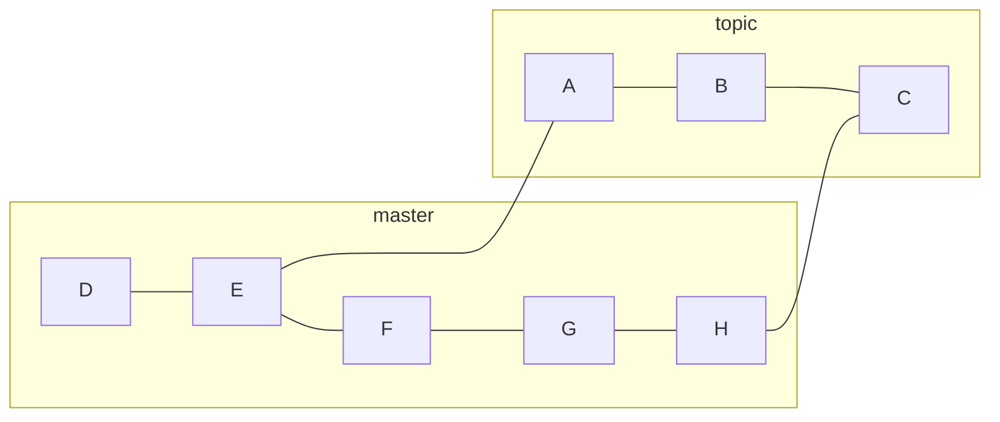

# git-merge
> git-merge - Join two or more development histories together

## How to use `git merge`
1. **Switch to the Target Branch**: Before merging, you need to switch to the branch that you want to merge the changes into. For example, if you want to merge changes into `main`, you would first check out the `main` branch:
    ```bash 
    git checkout main
    ```
2. **Merge the Feature Branch**: Next, you merge the branch containing the desired changes (let's call this `feature-branch`) into your current branch (`main` in this example). You do this with the `git merge` command:
    ```bash 
    git merge feature-branch
    ```
3. **Resolve Conflicts (if any)**: Sometimes, merging can result in conflicts, especially if the same lines of code were changed in both branches. If this happens, Git will notify you, and you'll need to manually resolve these conflicts. This usually involves editing the files to make the necessary adjustments and then marking the conflicts as resolved.
4. **Commit the Merge**: After resolving any conflicts, you'll need to commit the merge. If there were no conflicts, the merge is often committed automatically.
5. **Push the Changes (if using a remote repository)**: If you are working with a remote repository, you should push your changes to update the remote branch:
	```bash 
	git push origin main 
	```
## DESCRIPTION
Assume the following history exists and the current branch is `master`:

Then `git merge topic` will replay the changes made on the `topic` branch since it diverged from `master` (i.e., `E`) until its current commit (`C`) on top of `master`, and record the result in a new commit along with the names of the two parent commits and a log message from the user describing the changes. Before the operation, `ORIG_HEAD` is set to the tip of the current branch (`C`).

## Three-Way Merge 
> là một quy trình hợp nhất hai nhánh dựa trên ba điểm khác nhau trong lịch sử của chúng: hai đầu của nhánh cần hợp nhất và một điểm chung gần nhất của chúng, thường được gọi là "common ancestor".
## Merge strategies
### Fast-Forward Merge
### No-Fast-Forward Merge
### Recursive Merge
### Octopus Merge 
### Squash Merge `(--squash)`
### Ours và Theirs
# How to solve merge conflicts
> Merge conflicts happen when you merge branches that have competing changes are made to the same line of a file, or when one person edits a file and another person deletes the same file.
- If your merge conflict is caused by competing line changes, such as when people make different changes to the same line of the same file on different branches in your Git repository, you can resolve it on GitHub using the conflict editor.
- For all other types of merge conflicts, you must resolve the merge conflict in a local clone of the repository and push the change to your branch on GitHub. You can use the command line or a tool like [GitHub Desktop](https://desktop.github.com/) to push the change.
## Resolving a merge conflict on GitHub
- Using the conflict editor
- How to [[#Resolving a merge conflict on GitHub]]
	1. Under your repository name, click  **Pull requests**.
		
	2. In the "Pull Requests" list, click the pull request with a merge conflict that you'd like to resolve.
	3. Near the bottom of your pull request, click **Resolve conflicts**.
	    
	    **Note:** If the **Resolve conflicts** button is deactivated, your pull request's merge conflict is too complex to resolve on GitHub. You must resolve the merge conflict using an alternative Git client, or by using Git on the command line. For more information see "[Resolving a merge conflict using the command line](https://docs.github.com/en/pull-requests/collaborating-with-pull-requests/addressing-merge-conflicts/resolving-a-merge-conflict-using-the-command-line)."
	4. Decide if you want to keep only your branch's changes, keep only the other branch's changes, or make a brand new change, which may incorporate changes from both branches. Delete the conflict markers `<<<<<<<`, `=======`, `>>>>>>>` and make the changes you want in the final merge.
	5. If you have more than one merge conflict in your file, scroll down to the next set of conflict markers and repeat steps four and five to resolve your merge conflict.
	6. Once you've resolved all the conflicts in the file, click **Mark as resolved**.
	    
	7. If you have more than one file with a conflict, select the next file you want to edit on the left side of the page under "conflicting files" and repeat steps four through seven until you've resolved all of your pull request's merge conflicts.
	
	8. Once you've resolved all your merge conflicts, click **Commit merge**. This merges the entire base branch into your head branch.
	    
	9. If prompted, review the branch that you are committing to.
	    - If the head branch is the default branch of the repository, you can choose either to update this branch with the changes you made to resolve the conflict, or to create a new branch and use this as the head branch of the pull request.
	    - If you choose to create a new branch, enter a name for the branch.
	    - If the head branch of your pull request is protected you must create a new branch. You won't get the option to update the protected branch.
	    Click **Create branch and update my pull request** or **I understand, continue updating BRANCH**. The button text corresponds to the action you are performing.
	10. To merge your pull request, click **Merge pull request**. For more information about other pull request merge options, see "[Merging a pull request](https://docs.github.com/en/pull-requests/collaborating-with-pull-requests/incorporating-changes-from-a-pull-request/merging-a-pull-request)."
## Resolving a merge conflict using the command line
